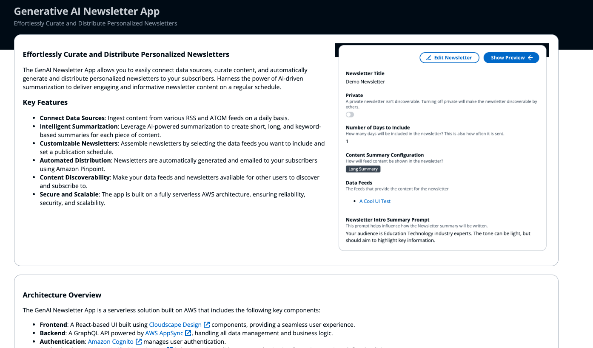

# Generative AI Newsletter Application

The Generative AI Newsletter Application sample is a ready-to-use serverless solution designed to allow users to create rich newsletters automatically with content summaries that are AI-generated. 

The application offers users the ability to influence the generative AI prompts to customize how content is summarized such as the tone, intended audience, and more. Users can stylize the HTML newsletter, define how frequently newsletters are created and share the newsletters with others. 



## Deploying the Solution

The solution is developed using AWS Cloud Development Kit (CDK), TypeScript, & NodeJS

### Prerequisites
* You will need an [AWS Account](https://repost.aws/knowledge-center/create-and-activate-aws-account).

* Either an [IAM User](https://console.aws.amazon.com/iamv2/home?#/users/create) or [IAM Identity Center User](https://aws.amazon.com/iam/identity-center/) with `AdministratorAccess` policy granted to your user. *Not recommended for a production environment.*
* [AWS CLI](https://aws.amazon.com/cli/) installed and configured to use with your AWS account.
* [NodeJS 20](https://nodejs.org/en/download/) installed
* The `ARN` of your [verified email identity](https://docs.aws.amazon.com/pinpoint/latest/userguide/channels-email-manage-verify.html) that you will send newsletter emails from. You will also be asked to provide an email address that will be the sender, which must be associated with the verified email identity.


### Deployment

1. Clone the repository
	```
	git clone https://github.com/aws-samples/generative-ai-newsletter-app/
	```
1. Change directory into the cloned repository
	```
	cd generative-ai-newsletter-app
	```
1. Install the project dependencies & build the project
	```
	npm install && npm run build
	```
1. Run the configuration wizard to create a deployment configuration file.
	```
	npm run config manage
	```
	The configuration wizard will generate a configuration file in `bin/config.json`. This file will be used during the deployment. Unless you need to change the configuration file, you do not need to run the configuration wizard for future deployments. If you change the **Stack Name**, it will cause a new deployment to occur. 

1. [*Optional*] Bootstrap AWS CDK on the target AWS Account & Region. 
	> Note: This is required if you have never used AWS CDK on this account and region combination. ([More information on CDK bootstrapping](https://docs.aws.amazon.com/cdk/latest/guide/cli.html#cli-bootstrap)).

1. Deploy the solution
	```
	npx cdk deploy
	```
	You can view the progress of your CDK deployment in the [CloudFormation console](https://console.aws.amazon.com/cloudformation/home) in the selected region.

1. Once the deployment is complete, CDK should show outputs that resemble the following. (Note: terms in brackets represents a generated/dynamic value)
	```
	...
	Outputs:
	[stackName].AppLink = https://dxxxxxxxxxxxxx.cloudfront.net/
	[stackName].UserPoolLink = https://[region].console.aws.amazon.com/cognito/v2/idp/user-pools/xxxxx_XXXXX/users?region=[region]
	...
	```	
	If you need these outputs again, you can view the deployment in the [CloudFormation console](https://console.aws.amazon.com/cloudformation/home) by navigating to the deployed stack and visiting the "Outputs" tab.

### Creating Users

User accounts for the application are managed using [Amazon Cognito](https://aws.amazon.com/cognito/).

1. Navigate to the Amazon Cognito in the AWS Console and select the User Pool deployed with the solution. Alternatively, you can navigate directly to the user pool by navigating to the `UserPoolLink` provided in the CDK output/CloudFormation output. 
1. In the **Users** box, click the **Create user** button.
1. Complete the user information form. 
	It is recommended to select "Send an email invitation".
	The Email address is required. 
1. Once the form is complete, click the **Create user** button.

### First Time Login

1. Navigate to the `AppLink` URL provided in the CDK or CloudFormation output. This is the main URL for the application. 
1. Login with the email and temporary password.
1. If login is successful, you will be asked to provide your name and update your password.
1. After you complete the name and password update, you will be logged into the application and can get started.


### User Guide
To learn how to start ingesting data with Data Feeds and creating dynamic Newsletters, visit the [User Guide](./USER_GUIDE.md).

## Author

* [Addie Rudy](https://www.linkedin.com/in/addierudy/)

## Threat Model

Review the threat model developed for the solution [here](THREAT_MODEL.md). Additionally, you can download the [Threat Model JSON](documentation-assets/GenAINewsletter_ThreatComposer.json) and view the visualized threat model by importing the JSON into [Threat Composer](https://awslabs.github.io/threat-composer/workspaces/default/dashboard).

## License

This library is licensed under the MIT-0 License. See the [LICENSE](LICENSE) file. 

Third-party dependencies have their own licenses. See the [NOTICE](NOTICE) file.

## Additional Resources

- [Changelog](CHANGELOG.md)
- [License](LICENSE)
- [Code of Content](CODE_OF_CONDUCT.md)
- [Contributing](CONTRIBUTING.md)