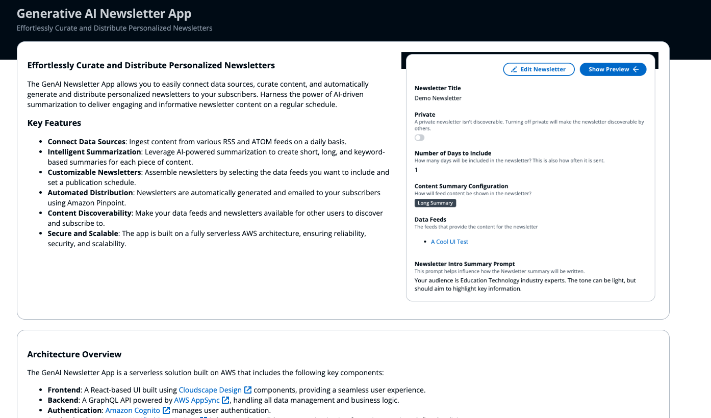

# Generative AI Newsletter Application

The Generative AI Newsletter Application sample is a ready-to-use serverless solution designed to allow users to create rich newsletters automatically with content summaries that are AI-generated. 

The application offers users the ability to influence the generative AI prompts to customize how content is summarized such as the tone, intended audience, and more. Users can stylize the HTML newsletter, define how frequently newsletters are created and share the newsletters with others. 

## Author

* [Addie Rudy](https://www.linkedin.com/in/addierudy/)

# Contributors

## Threat Model

The threat model for this solution can be found [here](https://aws-samples.github.io/generative-ai-newsletter-app/threat-model).

## License

This library is licensed under the MIT-0 License. See the [LICENSE](LICENSE) file. 

Third-party dependencies have their own licenses. See the [NOTICE](NOTICE) file.

## Additional Resources

- [Changelog](CHANGELOG.md)
- [License](LICENSE)
- [Code of Content](CODE_OF_CONDUCT.md)
- [Contributing](CONTRIBUTING.md)