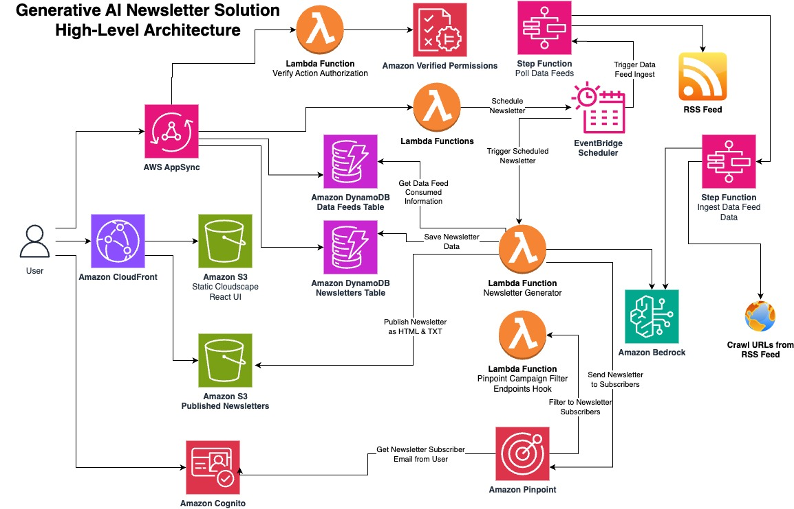
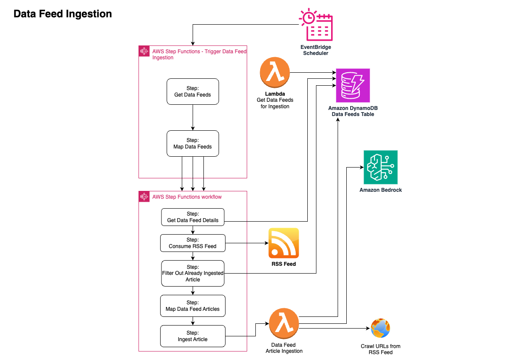
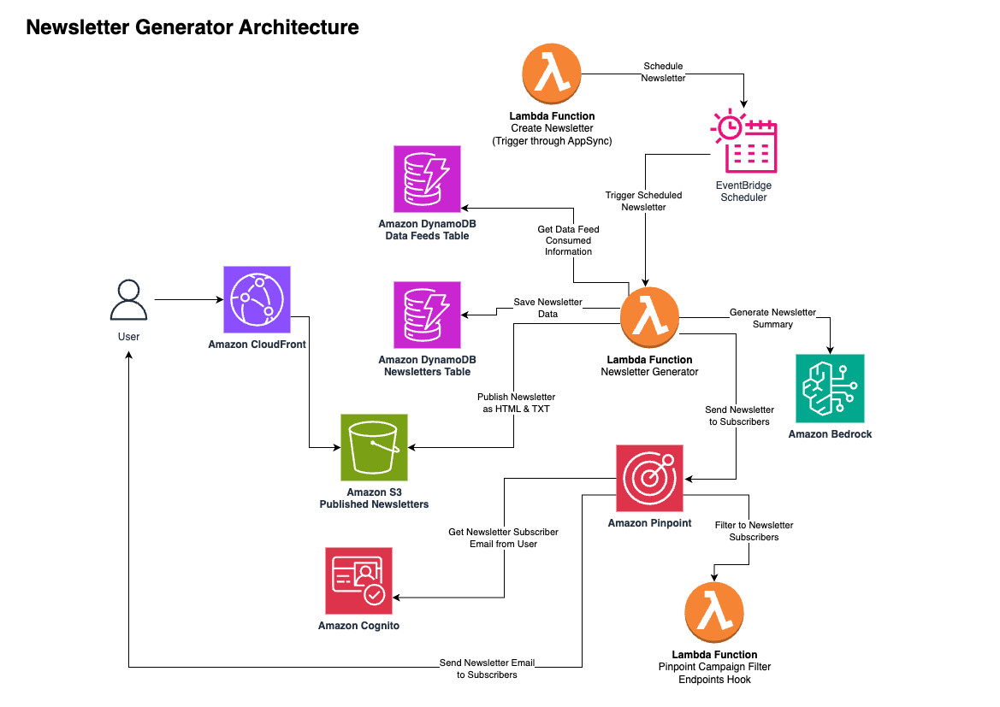

# AWS GenAI Newsletter Sample Solution
## Application Info
This solution provides a serverless application for setting up RSS/ATOM data feeds, generating summaries of articles from those feeds using customizable prompts, creating newsletters by selecting multiple data feeds and their summaries, generating an overall newsletter summary, subscribing to public or private newsletters, and flagging incorrect summaries for review.

## Architecture
### Introduction
**The GenAI Newsletter Solution is a serverless architecture on AWS that automates the generation and distribution of newsletters by aggregating data from various sources.** 

Here's a detailed description of the high-level architecture:

1. **User Interaction:**
   - The user interacts with the solution through AWS AppSync, which provides a GraphQL API for managing user interactions.
   - Amazon CloudFront is used to serve the static content to the user.

2. **Data Ingestion and Processing:**
   - The solution ingests data feeds from various sources using AWS Step Functions and Lambda functions.
   - The Lambda functions retrieve the data feeds, map the data, and ingest the articles into an Amazon DynamoDB table.
   - Amazon Bedrock is used to summarize crawled URLs from the RSS feed and ingest the data.

3. **Newsletter Generation:**
   - The newsletter generation process is triggered by the EventBridge Scheduler.
   - A Lambda function retrieves the data feed information from the Amazon DynamoDB table and generates the newsletter content.
   - The newsletter content is then saved in an Amazon S3 bucket, and the newsletter metadata is stored in another Amazon DynamoDB table.

4. **Newsletter Distribution:**
   - The solution uses Amazon Pinpoint to filter the newsletter subscribers and send the newsletters to them.
   - A Lambda function is responsible for sending the newsletter emails to the subscribers.
   - The Lambda function also integrates with Amazon Pinpoint to track the campaign metrics and filter the newsletter subscribers.

5. **Security and Authorization:**
   - The solution uses a Lambda function to verify the action authorization before performing any critical operations, such as scheduling a newsletter or ingesting data feeds.
   - Amazon Verified Permissions is used to ensure that only authorized users can perform these actions.

6. **Scalability and Reliability:**
   - The use of serverless services, such as AWS Lambda, Amazon DynamoDB, and Amazon S3, provides automatic scaling and high availability for the solution.
   - EventBridge Scheduler is used to trigger the newsletter generation process, ensuring reliable and scheduled newsletter delivery.

*Overall, the GenAI Newsletter Solution leverages various AWS services, including AWS AppSync, Amazon CloudFront, AWS Step Functions, AWS Lambda, Amazon DynamoDB, Amazon S3, Amazon Bedrock, Amazon Pinpoint, and Amazon Verified.*
### Architecture Diagram

## Dataflow
### Introduction
The data flows provide an in-depth look at the GenAI Newsletter Solution operates. This outlines the key processes and interactions that enable the solution to function.

#### Entities:

| Entity | Description |
|-|-|  
| User | The individual who interacts with the system |
| Web App | The frontend interface for input and output |
| Amazon Cognito | Handles user authentication |
| GraphQL API | Orchestrates API requests and responses in AppSync |
| Lambda| Serverless functions interacting with services |
| Amazon Bedrock | Generates responses to queries |
| DynamoDB | Stores Newsletter and Data Feed Information |

#### Data flows definition:

| Flow Identifier | Flow Description | Source Entity | Target Entity | Assets |
|-|-|-|-|-|  
| DF1 | User Browses Solution, Creates Feeds or Newsletters | User | Web App | User supplied prompts and feed URLs |
| DF2 | Request is Authenticated | Web App | Amazon Cognito | Credentials + Authentication tokens |   
| DF3 | GraphQL request handled | Web App | GraphQL API | User request, Authentication tokens|
| DF4 | Backend processing of requests | GraphQL API | Lambda | GraphQL Resolver Request |
| DF5 | Store and Retrieve Newsletter and Data Feed Data | Lambda | DynamoDB | Supplied and generated data|
| DF6 | Parse External RSS Feed | Lambda | External URL | URL of Feed |
| DF7 | Parse External articles listed in RSS Feed | Lambda | External URL | Article URL extracted from RSS Feed  |
| DF8 | Generated Summarization of Articles and Newsletters | Amazon Bedrock | Lambda | LLM Promt / LLM response |  

#### Trust boundaries:

| Boundary Identifier | Purpose | Source Entity | Target Entity |
|-|-|-|-|
| TB1 | Validates input, ensures privacy | User | Web App |
| TB2 | Allows authorized backend access | Web App | Amazon Cognito |
| TB3 | Triggers Queries and Backend Processing Securely | AppSync GraphQL API | Lambda, DynamoDB |  
| TB4 | Query specific IAM Roles limit access | Lambda | DynamoDB |
| TB5 | Securely Crawls RSS Feed URL w/o executing page load | Lambda | External RSS Feed |
| TB6 | Securely Crawls RSS Feed Articles w/o executing page load | Lambda | External URL retrieved from RSS Feed. |
| TB7 | Strict prompting wraps dynamic data from external sources to ensure it is treated only as text input and not prompt instruction | Lambda | Amazon Bedrock | 

#### Possible threat sources:

The table below categorizes the various threat sources mentioned across the threat statements in the next section:

| Category | Description | Examples |
|-|-|-|
| Legitimate Users | Valid users who unintentionally trigger issues | An internal actor, An end user|   
| Malicious Internal Actors | Trusted insiders who intentionally cause harm | An overprivileged LLM plugin, An internal plugin or agent developer, An LLM developer or trainer|  
| External Threat Actors | External attackers targeting the system | A threat actor, An external threat actor - A malicious user (with system access)|
| Untrusted Data Suppliers | External data sources that provide bad data | A third-party data supplier, A data supplier|  
| Unauthorized External Users | External entities with no system access | A malicious user (no system access)|

### Dataflow Diagram

## Assumptions

| Assumption Number | Assumption | Linked Threats | Linked Mitigations | Comments |
| --- | --- | --- | --- | --- |
| A-0005 | The solution is deployed into an AWS environment with best-practice account\/user-access controls in place. | [**T-0001**](#T-0001): A malicious user with the ability to interact with an LLM system can overwrite the system prompt with crafted prompts, which leads to force unintended actions from the LLM, negatively impacting LLM system and connected resources [**T-0003**](#T-0003): A malicious user who is able to create data feeds can create data feeds that resolve to malicious URLs, which leads to malicious scripts being processed during website crawling, resulting in reduced integrity of generated content and summarizations [**T-0004**](#T-0004): An LLM with insufficient safegaurds against harmful content generation during prompting or inference can generate malicious outputs, which leads to vulnerabilities like command injections in integrated downstream functions when malicious outputs are passed to them, resulting in reduced confidentiality, integrity, and\/or availability of LLM systems [**T-0005**](#T-0005): A malicious user can read information they should not be authorized to read, which leads to data disclosure [**T-0007**](#T-0007): An external threat actor can interact with the exposed API, which leads to the actor being able to do anything the user can do [**T-0008**](#T-0008): A malicious user can share data feeds or newsletters with unsafe or untrue content, which leads to dissemination of misinformation, resulting in reduced integrity of generated content and summarizations |  | 
For more details, visit <a href="https://docs.aws.amazon.com/IAM/latest/UserGuide/best-practices.html">Security best practices in IAM</a>.
 |
| A-0004 | The LLM application undergoes security testing and audit	 | [**T-0002**](#T-0002): A malicious user able to create Data Feeds or Newsletters can provide malicious prompts, which leads to manipulating the LLM into generating harmful actions, resulting in reduced integrity of generated content and summarizations [**T-0003**](#T-0003): A malicious user who is able to create data feeds can create data feeds that resolve to malicious URLs, which leads to malicious scripts being processed during website crawling, resulting in reduced integrity of generated content and summarizations [**T-0004**](#T-0004): An LLM with insufficient safegaurds against harmful content generation during prompting or inference can generate malicious outputs, which leads to vulnerabilities like command injections in integrated downstream functions when malicious outputs are passed to them, resulting in reduced confidentiality, integrity, and\/or availability of LLM systems |  |  |
| A-0003 | The LLM system has limited network connectivity and access controls	 | [**T-0002**](#T-0002): A malicious user able to create Data Feeds or Newsletters can provide malicious prompts, which leads to manipulating the LLM into generating harmful actions, resulting in reduced integrity of generated content and summarizations |  |  |
| A-0002 | Access to training or knowledge pipelines is restricted using authentication and authorization controls	 | [**T-0008**](#T-0008): A malicious user can share data feeds or newsletters with unsafe or untrue content, which leads to dissemination of misinformation, resulting in reduced integrity of generated content and summarizations |  |  |
| A-0001 | The LLM training data does not contain sensitive personal information | [**T-0008**](#T-0008): A malicious user can share data feeds or newsletters with unsafe or untrue content, which leads to dissemination of misinformation, resulting in reduced integrity of generated content and summarizations |  |  |

## Threats

| Threat Number | Threat | Mitigations | Assumptions | Priority | STRIDE | Comments |
| --- | --- | --- | --- | --- | --- | --- |
| T-0008 | A malicious user can share data feeds or newsletters with unsafe or untrue content, which leads to dissemination of misinformation, resulting in reduced integrity of generated content and summarizations | [**M-0010**](#M-0010): Include disclosure in all newsletters about potentially inaccurate summarizations [**M-0009**](#M-0009): Allow users to flag inaccurate data [**M-0008**](#M-0008): Individual user authentication | [**A-0001**](#A-0001): The LLM training data does not contain sensitive personal information [**A-0002**](#A-0002): Access to training or knowledge pipelines is restricted using authentication and authorization controls	 [**A-0005**](#A-0005): The solution is deployed into an AWS environment with best-practice account\/user-access controls in place. |  Medium | R |  |
| T-0007 | An external threat actor can interact with the exposed API, which leads to the actor being able to do anything the user can do | [**M-0005**](#M-0005): Apply CORS restrictions [**M-0007**](#M-0007): Check authorization for all user actions [**M-0006**](#M-0006): Client authentication [**M-0002**](#M-0002): Restrict LLM capabilities through permissions | [**A-0005**](#A-0005): The solution is deployed into an AWS environment with best-practice account\/user-access controls in place. |  High |  |  |
| T-0005 | A malicious user can read information they should not be authorized to read, which leads to data disclosure | [**M-0006**](#M-0006): Client authentication [**M-0008**](#M-0008): Individual user authentication [**M-0007**](#M-0007): Check authorization for all user actions | [**A-0005**](#A-0005): The solution is deployed into an AWS environment with best-practice account\/user-access controls in place. |  Medium | I |  |
| T-0004 | An LLM with insufficient safegaurds against harmful content generation during prompting or inference can generate malicious outputs, which leads to vulnerabilities like command injections in integrated downstream functions when malicious outputs are passed to them, resulting in reduced confidentiality, integrity, and\/or availability of LLM systems | [**M-0004**](#M-0004): Encode outputs to prevent unintended code execution [**M-0002**](#M-0002): Restrict LLM capabilities through permissions | [**A-0005**](#A-0005): The solution is deployed into an AWS environment with best-practice account\/user-access controls in place. [**A-0004**](#A-0004): The LLM application undergoes security testing and audit	 |  Medium | T, I, R |  |
| T-0003 | A malicious user who is able to create data feeds can create data feeds that resolve to malicious URLs, which leads to malicious scripts being processed during website crawling, resulting in reduced integrity of generated content and summarizations | [**M-0003**](#M-0003): Segregate external content [**M-0004**](#M-0004): Encode outputs to prevent unintended code execution [**M-0002**](#M-0002): Restrict LLM capabilities through permissions | [**A-0005**](#A-0005): The solution is deployed into an AWS environment with best-practice account\/user-access controls in place. [**A-0004**](#A-0004): The LLM application undergoes security testing and audit	 |  High | S |  |
| T-0002 | A malicious user able to create Data Feeds or Newsletters can provide malicious prompts, which leads to manipulating the LLM into generating harmful actions, resulting in reduced integrity of generated content and summarizations | [**M-0002**](#M-0002): Restrict LLM capabilities through permissions [**M-0001**](#M-0001): Segregate user prompts from system prompts [**M-0004**](#M-0004): Encode outputs to prevent unintended code execution | [**A-0004**](#A-0004): The LLM application undergoes security testing and audit	 [**A-0003**](#A-0003): The LLM system has limited network connectivity and access controls	 |  High | T |  |
| T-0001 | A malicious user with the ability to interact with an LLM system can overwrite the system prompt with crafted prompts, which leads to force unintended actions from the LLM, negatively impacting LLM system and connected resources | [**M-0001**](#M-0001): Segregate user prompts from system prompts [**M-0002**](#M-0002): Restrict LLM capabilities through permissions [**M-0004**](#M-0004): Encode outputs to prevent unintended code execution | [**A-0005**](#A-0005): The solution is deployed into an AWS environment with best-practice account\/user-access controls in place. |  High | T |  |

## Mitigations

| Mitigation Number | Mitigation | Threats Mitigating | Assumptions | Comments |
| --- | --- | --- | --- | --- |
| M-0010 | Include disclosure in all newsletters about potentially inaccurate summarizations | [**T-0008**](#T-0008): A malicious user can share data feeds or newsletters with unsafe or untrue content, which leads to dissemination of misinformation, resulting in reduced integrity of generated content and summarizations |  | 
<strong>Details</strong>

All newsletters include a footer disclosure that summarizations were generated using Generative AI and that summaries may be inappropriate or inaccurate. This creates transparency to end-users, providing trust.
 |
| M-0009 | Allow users to flag inaccurate data | [**T-0008**](#T-0008): A malicious user can share data feeds or newsletters with unsafe or untrue content, which leads to dissemination of misinformation, resulting in reduced integrity of generated content and summarizations |  | 
<strong>Details</strong>

Users are able to flag summarizations within the application, as well as deep-links from Newsletter emails. This allows user to flag content as they receive it in their inbox.
 |
| M-0008 | Individual user authentication | [**T-0005**](#T-0005): A malicious user can read information they should not be authorized to read, which leads to data disclosure [**T-0008**](#T-0008): A malicious user can share data feeds or newsletters with unsafe or untrue content, which leads to dissemination of misinformation, resulting in reduced integrity of generated content and summarizations |  | 
<strong>Details</strong>

End-users each have their own account within Amazon Cognito. Cognito enables secure authentication, authorization, and user management for both web and mobile applications through features like two-factor authentication, JSON web tokens, and fine-grained access controls. It supports scaling to millions of users, integrates with social and enterprise identity systems, and provides capabilities like user pools, identity pools, and synchronized logins. The standards-based integration process is streamlined, allowing for rapid implementation of user authentication and access control in applications using protocols like SAML and OIDC.
 |
| M-0007 | Check authorization for all user actions | [**T-0005**](#T-0005): A malicious user can read information they should not be authorized to read, which leads to data disclosure [**T-0007**](#T-0007): An external threat actor can interact with the exposed API, which leads to the actor being able to do anything the user can do |  | 
<strong>Details</strong>

Amazon Verified Permissions is leveraged to apply policy based validation of user actions to ensure actions and data access are granted to the current user.
 |
| M-0006 | Client authentication | [**T-0005**](#T-0005): A malicious user can read information they should not be authorized to read, which leads to data disclosure [**T-0007**](#T-0007): An external threat actor can interact with the exposed API, which leads to the actor being able to do anything the user can do |  | 
<strong>Details</strong>

Client authentication and authorization for applications can be efficiently managed using Amazon Cognito as a centralized identity provider. Cognito enables secure authentication, authorization, and user management for both web and mobile applications through features like two-factor authentication, JSON web tokens, and fine-grained access controls. It supports scaling to millions of users, integrates with social and enterprise identity systems, and provides capabilities like user pools, identity pools, and synchronized logins. The standards-based integration process is streamlined, allowing for rapid implementation of user authentication and access control in applications using protocols like SAML and OIDC.

More details about Amazon Cognito is available <a href="https://docs.aws.amazon.com/cognito/latest/developerguide/cognito-user-identity-pools.html">here</a>
 |
| M-0005 | Apply CORS restrictions | [**T-0007**](#T-0007): An external threat actor can interact with the exposed API, which leads to the actor being able to do anything the user can do |  | 
<strong>Details</strong>

CORS (Cross-Origin Resource Sharing) restrictions on the API endpoints that interface with the LLM help mitigate exploits.
 |
| M-0004 | Encode outputs to prevent unintended code execution | [**T-0001**](#T-0001): A malicious user with the ability to interact with an LLM system can overwrite the system prompt with crafted prompts, which leads to force unintended actions from the LLM, negatively impacting LLM system and connected resources [**T-0002**](#T-0002): A malicious user able to create Data Feeds or Newsletters can provide malicious prompts, which leads to manipulating the LLM into generating harmful actions, resulting in reduced integrity of generated content and summarizations [**T-0003**](#T-0003): A malicious user who is able to create data feeds can create data feeds that resolve to malicious URLs, which leads to malicious scripts being processed during website crawling, resulting in reduced integrity of generated content and summarizations [**T-0004**](#T-0004): An LLM with insufficient safegaurds against harmful content generation during prompting or inference can generate malicious outputs, which leads to vulnerabilities like command injections in integrated downstream functions when malicious outputs are passed to them, resulting in reduced confidentiality, integrity, and\/or availability of LLM systems |  | 
<strong>Details</strong>Using thorough input validation and sanitization on prompts, as well as clear prompting on expected output to prevent prompt injection attacks.
 |
| M-0003 | Segregate external content | [**T-0003**](#T-0003): A malicious user who is able to create data feeds can create data feeds that resolve to malicious URLs, which leads to malicious scripts being processed during website crawling, resulting in reduced integrity of generated content and summarizations |  | 
<strong>Details</strong>

External content, such as crawled websites identified in Data Feeds are stored in S3 and then sanitized to extract text content prior to it being passed to the LLM
 |
| M-0002 | Restrict LLM capabilities through permissions | [**T-0001**](#T-0001): A malicious user with the ability to interact with an LLM system can overwrite the system prompt with crafted prompts, which leads to force unintended actions from the LLM, negatively impacting LLM system and connected resources [**T-0002**](#T-0002): A malicious user able to create Data Feeds or Newsletters can provide malicious prompts, which leads to manipulating the LLM into generating harmful actions, resulting in reduced integrity of generated content and summarizations [**T-0003**](#T-0003): A malicious user who is able to create data feeds can create data feeds that resolve to malicious URLs, which leads to malicious scripts being processed during website crawling, resulting in reduced integrity of generated content and summarizations [**T-0004**](#T-0004): An LLM with insufficient safegaurds against harmful content generation during prompting or inference can generate malicious outputs, which leads to vulnerabilities like command injections in integrated downstream functions when malicious outputs are passed to them, resulting in reduced confidentiality, integrity, and\/or availability of LLM systems [**T-0007**](#T-0007): An external threat actor can interact with the exposed API, which leads to the actor being able to do anything the user can do |  | 
<strong>Details</strong>

Resources that connect to the LLM have least privilege access patterns. The AWS Well-Architected Framework's best practice <a href="https://docs.aws.amazon.com/wellarchitected/latest/framework/sec_permissions_least_privileges.html">SEC03-BP02 recommends granting least privilege access</a> to identities like service accounts, which can help secure access to AI systems and limit potential impacts if credentials are exposed.
 |
| M-0001 | Segregate user prompts from system prompts | [**T-0001**](#T-0001): A malicious user with the ability to interact with an LLM system can overwrite the system prompt with crafted prompts, which leads to force unintended actions from the LLM, negatively impacting LLM system and connected resources [**T-0002**](#T-0002): A malicious user able to create Data Feeds or Newsletters can provide malicious prompts, which leads to manipulating the LLM into generating harmful actions, resulting in reduced integrity of generated content and summarizations |  | 
<strong>Details</strong>

User prompts are never sent to the model without necessary context and instructions.Prompts to models enclose user prompts within XML tags, with clear instructions to ensure the model treats the input as only input, not instruction/context.

Additionally, all prompts have defensive instructions to avoid generating malicious output.
 |

## Impacted Assets

| Assets Number | Asset | Related Threats |
| --- | --- | --- |
| AS-0001 | generated content and summarizations | [**T-0008**](#T-0008): A malicious user can share data feeds or newsletters with unsafe or untrue content, which leads to dissemination of misinformation, resulting in reduced integrity of generated content and summarizations [**T-0003**](#T-0003): A malicious user who is able to create data feeds can create data feeds that resolve to malicious URLs, which leads to malicious scripts being processed during website crawling, resulting in reduced integrity of generated content and summarizations [**T-0002**](#T-0002): A malicious user able to create Data Feeds or Newsletters can provide malicious prompts, which leads to manipulating the LLM into generating harmful actions, resulting in reduced integrity of generated content and summarizations |
| AS-0002 | LLM systems | [**T-0004**](#T-0004): An LLM with insufficient safegaurds against harmful content generation during prompting or inference can generate malicious outputs, which leads to vulnerabilities like command injections in integrated downstream functions when malicious outputs are passed to them, resulting in reduced confidentiality, integrity, and\/or availability of LLM systems |
| AS-0003 | LLM system and connected resources | [**T-0001**](#T-0001): A malicious user with the ability to interact with an LLM system can overwrite the system prompt with crafted prompts, which leads to force unintended actions from the LLM, negatively impacting LLM system and connected resources |

