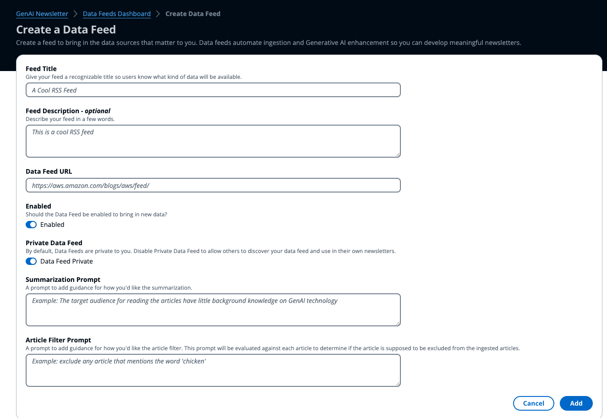
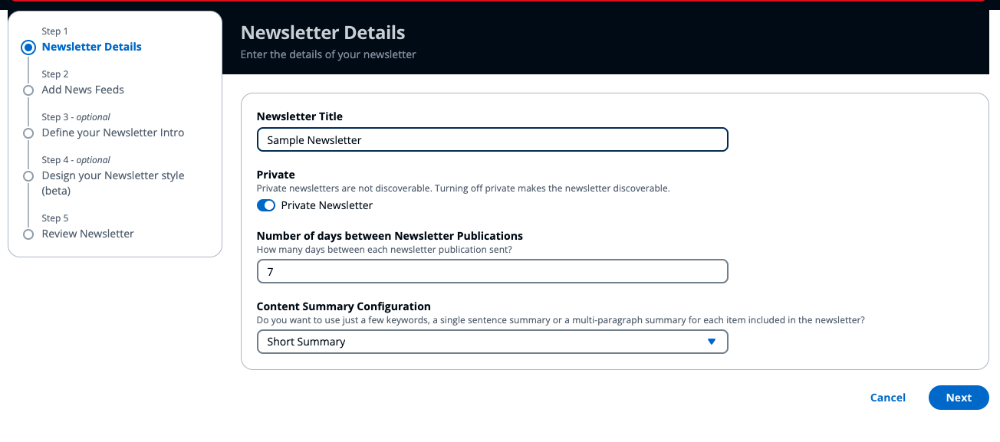
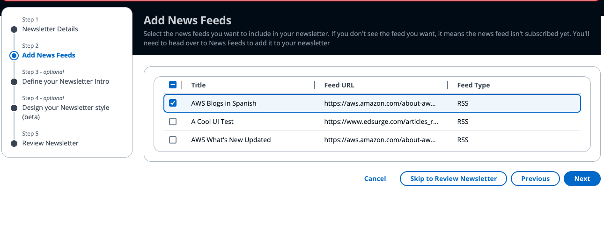
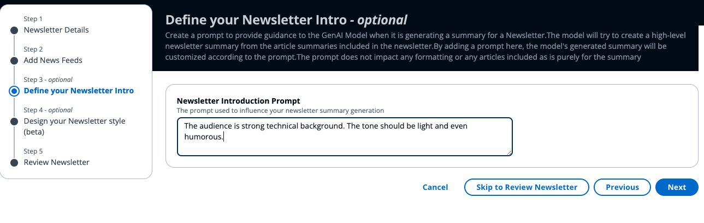
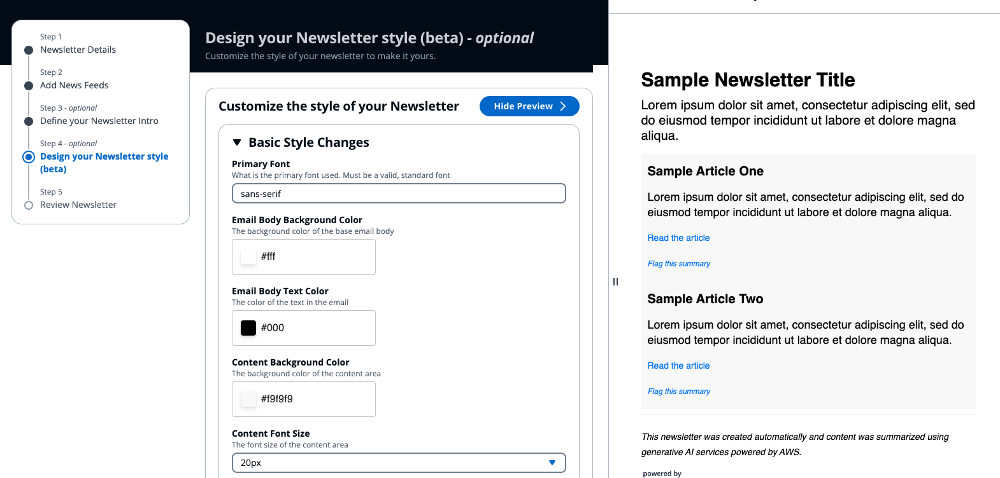
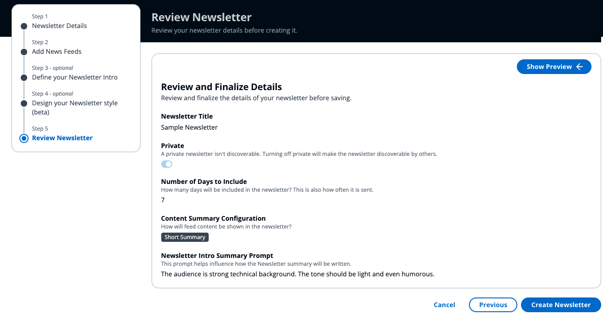
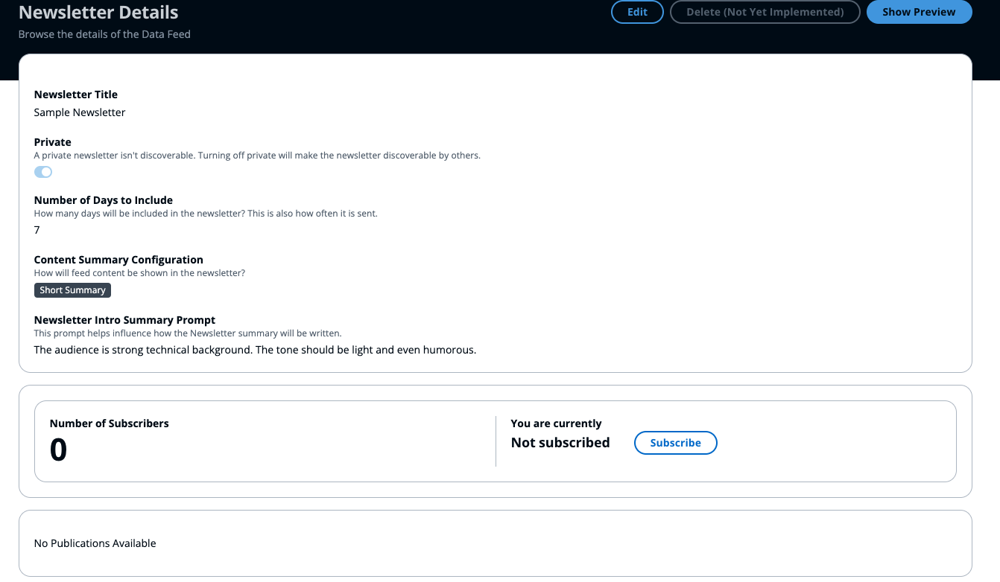

# User Guide

## Deployment
For instructions on deploying the solution, visit the [Deployment Guide](./deployment). Once deployment is complete, check the [Post Deployment Guide](./post-deployment) to create users and login for the first time. 

## Setting up Data Feeds
Data Feeds automate ingesting data and summarizing the content for use within Newsletters. All Newsletters will require at least one Data Feed. Currently, only RSS & ATOM feeds are supported Data Feed types. 

To create your data feed:

1. Click **Create Data Feed** from the side panel menu.

1. Complete the details of the data feed form including a title, optional description, URL of the ATOM or RSS feed.

1. The **Summarization Prompt** instructs the Data Feed ingestion process on how to summarize the articles it consumes. Because this makes Data Feed summaries unique, you can create multiple Data Feeds for the same source and prompt each one to summarize differently. 

1. Click **Add** to create the Data Feed. 
You will be navigated to the Data Feed Details page. 

Once a Data Feed is created, the first run of ingestion will begin. Generally within 5 minutes, all articles currently on the RSS feed will have been ingested and summarized. You can revisit the Data Feed page or simply refresh the page if you haven't navigated away. 

## Creating Newsletters

1. To create a newsletter, go to the Newsletters Dashboard and click **Create Newsletter**.
1. In the Newsletter Wizard, completed the newsletter details and click **Next** to proceed. 

1. Add one or more data feeds to your newsletter. If you don't have any data feeds, you will need to create at least one first. See [Setting up Data Feeds](#setting-up-data-feeds).

1. *Optionally* add a Newsletter Introduction Prompt. This prompt will be used to influence how the each Newsletter publication's introduction will be written. 

1. *Optionally* customize the style of the newsletter to have a unique look and feel. Click the **Show Preview** button to live preview a sample newsletter with your custom style.

1. Finally, review the newsletter settings to confirm everything is correct. Then click the **Create Newsletter** button to create your newsletter. 

1. Once the newsletter is successfully created, you will be taken to the Newsletter detail page. By default **you are not subscribed** to the newly created Newsletter. 

## Subscribing to Newsletters

Subscribing to a newsletter allows you to receive the newsletter automatically in your email on the set schedule. Newsletters, by default, have no subscribes, including the newsletter owner. If a Newsletter has no subscribes, the Newsletter will still be generated and viewable in the application, but won't be emailed out. 

To subscribe to a Newsletter:

1. Go to the Newsletter Dashboard. The Dashboard shows newsletters that you have access to, including your private and non-private newsletters, and newsletters created by others that are non-private. 
1. *Optionally,* you can use the *Filter Newsletters* search box to filter the table results. 
1. Click the Newsletter Name of the Newsletter you'd like to view or subscribe to.
1. Below the Newsletter details, the number of subscribes and your current subscription status will be shown. If you are not subscribed, you can click the **Subscribe** button. If you are already subscribed, the button will show **Unsubscribe**.

*All emails include a footer unique to the recipient that allows them to unsubscribe from the newsletter without having to login to the application*

## Viewing My Subscriptions
To view Newsletters that you are currently subscribed to, simply click **My Newsletter Subscriptions** from the side panel. This will show you all Newsletters that you are currently subscribed to. 
> *Note: If a Newsletter owner decides to make their Newsletter private, it will no longer be visible to you. In this case, you will see a notice on the **My Subscriptions Page** indicating how many Newsletters are no longer visible.* 

From the page, click on the desired Newsletter to view the details and past publications.

## Unsubscribing From a Newsletter
To unsubscribe from a Newsletter, simply navigate to the Newsletter in the application and click the **Unsubscribe** button.

Alternatively, users can unsubscribe from any Newsletter using the **Unsubscribe from this newsletter** link in the footer of all Newsletter emails. This is a unique-to-the-user link.

> *Note: In the event that a newsletter is no longer visible, but you are still subscribed, the unsubscribe link in the email is the only way to unsubscribe. If you unsubscribe from a Newsletter you no can view, you will not be able to resubscribe to the Newsletter unless the owner updates the privacy.*

## Flagging Bad Data
Occasionally, a summary may not be generated in a way that is deemed accurate. To create transparency that data has been deemed inaccurate, users can opt to flag a summary. Below are the ways to flag data.

- Data Feed Article Summary
  - From the Data Feed Details page, click the flag on the row of the article summary that is incorrect
  - From the Newsletter Details page, when looking at generated Newsletter, if the "Flag this summary" link is available under an article, you can click the link to flag the article summary.This is a deep-link directly to the Data Feed detail page that will mark the article summary as flagged.
  - From the Newsletter email a user receives. Below the summary, users can select "Flag this summary". This is a deep-link directly to the Data Feed detail page that will mark the article summary as flagged.

- Newsletter Intro Summary
  - Flagging not yet available

## Deleting Data
Deleting newsletters, feeds, articles, summaries, etc. does not natively exist in the solution at this point. An admin can remove data from S3/DynamoDB if necessary.

